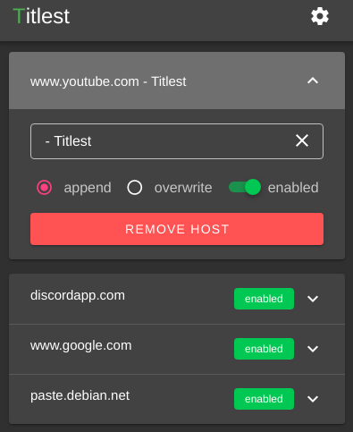

# Titlest

a simple extension to replace or append a websites title with whatever you want. the extension name is a play on the golf brand. no, im not a golfer.



## Overview

im trying to learn javascript and i figured this would be a good place to start as it solves a problem i have. some of the web apps/pages i use dont have a consistent or common title to be able to easily select them in an overview. with this i can set them to what i want.

the code is sloppy and probably redundant but its part of the learning process.

## Installation

> ~~before i push the extension to the respective browser stores i need to convert from sync storage to local storage. so be warned that your data could could be lost in an update.~~ i also need to make it cross browser compatible with firefox.\_

-  first you need to download the zip containing the compiled code for the [latest release](https://github.com/kinghat/Titlest/releases) and extract it to a directory of your choosing.

-  to install in chrome go to `chrome://extensions/` in your navigation bar. turn on "Developer Mode" in the top right and the click on the "Load unpacked" in the top left. select the directory you extracted the zip to. it should now be loaded as an "unpacked extension."

## Development

### Project setup

#### Clone or download the repository

use whichever method you want to obtain the code from the repo

#### Compile and hot-reload for development

```
yarn serve
npm run serve
```

#### Compile and minify for production

```
yarn build
npm run build
```
